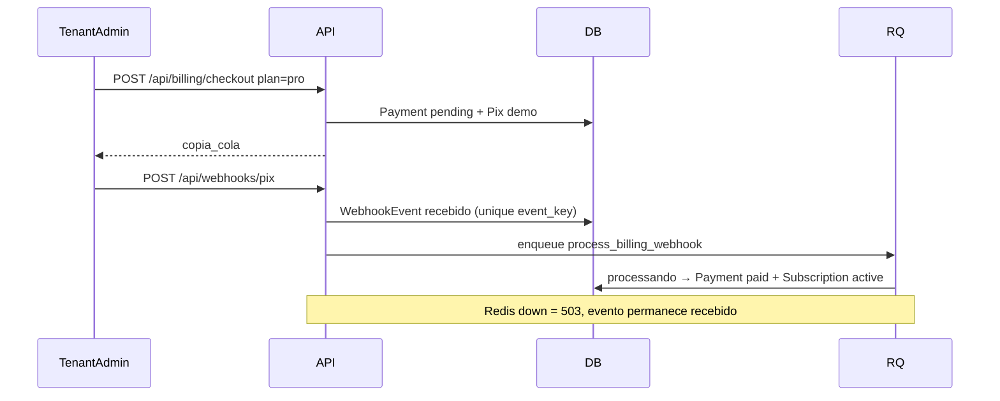

# OficinaFlow

SaaS B2B multi-tenant que eu montei pra oficinas e prestadores: **agenda + ordem de serviço**, com isolamento de tenant de verdade e cobrança de **assinatura da plataforma** via Pix (sandbox/demo).

Não é frete, não é courier, não é tracking. O problema de negócio é outro: várias oficinas no mesmo sistema, cada uma só vendo os próprios dados, com papéis claros e plano que trava mutação se a assinatura vencer.

**Status:** produto **completo para uso local** (API + front + testes + seed). Sem deploy público nesta fase.

## Stack

- Front: React, TypeScript, Vite (porta **5175**)
- API: Python, FastAPI, SQLAlchemy, Alembic (porta **8002**; 8001 costuma ser Redis Insight)
- Banco: PostgreSQL 16 (**5436**) + Redis 7 (**6383**)
- Auth: JWT em cookie httpOnly
- Fila: RQ no webhook de billing (`RQ_ASYNC=false` local = job no mesmo processo; `true` = worker separado)
- Rate limit no webhook (Redis, com fallback em memória)
- Logs JSON (accept/job/audit), health live + ready (Postgres/Redis)

Valores em centavos (`int`), tela em `R$ 1.234,56`, datas `DD/MM/AAAA`, fuso `America/Sao_Paulo`. Soft delete com `created_at`, `updated_at`, `deleted_at`.

## Decisões de engenharia (o que eu defenderia numa entrevista)

1. **Accept ≠ apply.** O HTTP do webhook só autentica, rate-limita, grava `WebhookEvent` (unique `event_key` + `payload_hash`) e enfileira. O efeito no `Payment`/`Subscription` roda no job. Se a fila cair → **503** e o evento fica `recebido` (falha parcial observável, não “sumiu”).
2. **Ciclo de vida:** `recebido → processando → processado | falhou`, com `attempts`, `last_error`, `processed_at`. Duplicata responde `duplicate: true` (também via `IntegrityError` sob corrida).
3. **Tenant no token, nunca no body.** Isolamento testado (A não lê OS de B = 404). STAFF bloqueado em billing/equipe (403). Assinatura vencida = **402** nas mutações.
4. **Audit append-only** em checkout, membership e soft deletes: quem fez o quê.
5. **Observabilidade de billing na UI:** pagamentos + webhook events (tenant) e stats/falhas (platform admin).

## Máquinas de estado

**Agendamento:** `scheduled → confirmed → in_progress → done` (também `cancelled` / `no_show`)

**OS:** `draft → open → in_progress → waiting_parts → done` (também `cancelled`)

Transição ilegal = 400 (testada unitariamente).

## Billing (assinatura SaaS)



Local: `RQ_ASYNC=false` (default) executa o job no accept via RQ sync (**mesmo código do worker**). Com `RQ_ASYNC=true`, use `make worker`.

Se `past_due` / `canceled` / `current_period_end` vencido → mutações de agenda/OS retornam **402**. Webhook duplicado responde `duplicate: true`.

## Subir local

```bash
chmod +x scripts/bootstrap.sh
./scripts/bootstrap.sh

# terminais separados
make api
make front
```

Ou manual:

```bash
cp .env.example .env
docker compose up -d
cd backend && python -m venv .venv && source .venv/bin/activate
pip install -r requirements.txt
cp ../.env.example .env
alembic upgrade head && python -m app.seed
uvicorn app.main:app --reload --port 8002

# outro terminal
cd frontend && npm install && npm run dev
```

Worker RQ (só se `RQ_ASYNC=true`):

```bash
make worker
```

### Seed

| Usuário | Senha | Tenant |
|---------|-------|--------|
| `platform@oficinaflow.com` | `senha123` | (slug vazio) |
| `admin@oficina-alfa.com` | `senha123` | `oficina-alfa` |
| `staff@oficina-alfa.com` | `senha123` | `oficina-alfa` |
| `admin@oficina-beta.com` | `senha123` | `oficina-beta` |

Swagger: http://localhost:8002/docs

## Testes

```bash
make test
# ou: cd backend && source .venv/bin/activate && pytest -q
```

Cobre FSM, isolamento A/B, gating 402, idempotência, falha parcial do webhook, matriz STAFF 403 e soft delete.

## Checklist local (fechado)

- [x] Multi-tenant + teste A não lê B
- [x] Roles platform / tenant admin / staff (403 testado)
- [x] FSM agenda + OS testadas
- [x] Billing: accept≠apply, ciclo de vida, idempotência, falha parcial
- [x] Soft delete + audit em ações críticas
- [x] Rate limit + health ready (DB/Redis) + logs JSON
- [x] UI: pagamentos + webhook events + stats platform
- [x] Seed BR, Swagger, Compose, CI
- [x] README de decisões
- [ ] Deploy público (fora de escopo agora)

## O que o sistema não faz

- Frete, motorista, mapa, tracking público
- NF-e / SEFAZ
- App mobile / microservices
- Deploy em produção

## Portas

| Serviço | Porta |
|---------|-------|
| Postgres | 5436 |
| Redis | 6383 |
| API | 8002 |
| Front | 5175 |
| Redis Insight (outro app) | 8001 |
